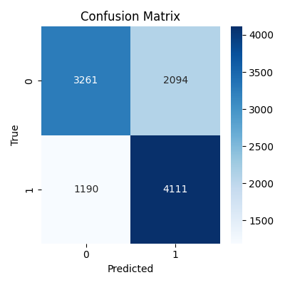

# AI视频检测系统

这是一个基于多模态时序特征的AI视频检测系统，用于判断视频是否为AI合成。系统采用三层架构设计，包括低层视觉特征、中层时序特征和高层语义特征。

## 项目结构

```
DeSY/
├── best_models_pth/           # 训练好的模型权重文件
├── models/                    # 各层模型代码
│   ├── low_level_vision.py
│   ├── mid_level_temporal.py
│   └── high_level_semantic.py
├── data/                      # 数据目录（原始、处理后、日志等）
├── results/                   # 结果输出（如csv）
├── train.py                   # 训练主脚本
├── fusion_classifier.py       # 融合推理主脚本
├── data_loader.py             # 数据加载与预处理
├── visualize_fusion.py        # 结果可视化（Streamlit）
├── requirements.txt           # 依赖包列表
└── README.md                  # 项目说明
```

## 安装依赖

建议使用虚拟环境：

```bash
python -m venv venv
source venv/bin/activate  # Windows下为 venv\Scripts\activate
pip install -r requirements.txt
```

## 快速开始

### 1. 检测推理
```python
from fusion_classifier import VideoAIDetector

detector = VideoAIDetector()
result = detector.detect(
    video_path="path/to/video.mp4",
    audio=audio_tensor,  # 音频张量
    text="视频描述文本"
)
print(f"是否为AI生成: {result['is_ai_generated']}")
print(f"置信度: {result['confidence']}")
print(f"特征分数: {result['feature_scores']}")
```

### 2. 训练模型

```bash
python train.py
```

### 3. 结果可视化

```bash
streamlit run visualize_fusion.py
```

## 注意事项

- 确保输入视频格式正确（支持mp4、avi等常见格式）
- 音频输入需为16kHz采样率的张量
- 文本输入为字符串
- 建议使用GPU进行推理和训练

## 许可证

MIT License 

## 检测结果示例

**混淆矩阵**



**ROC曲线**


**分数分布直方图**


**PR曲线**

 